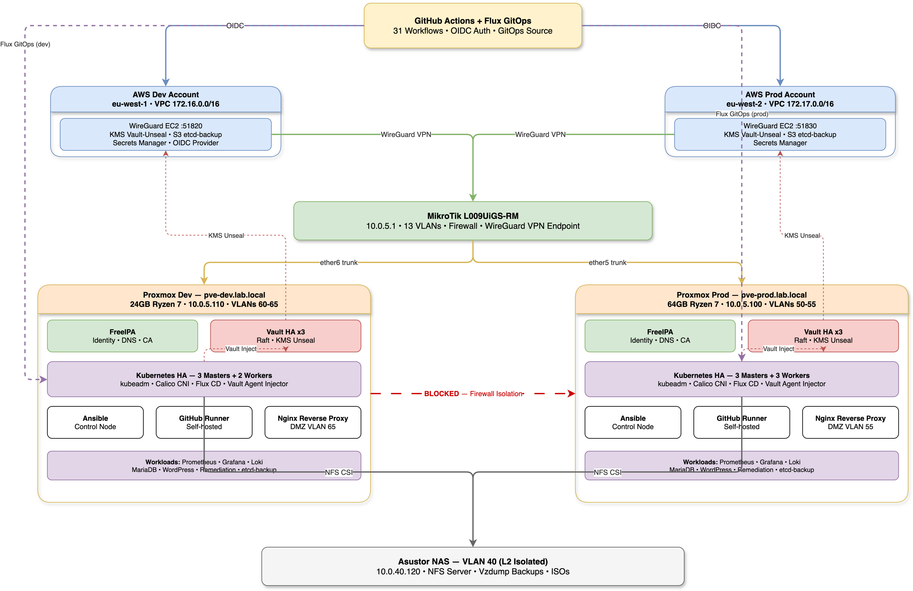

# Hybrid Cloud Infrastructure

Production-grade hybrid cloud lab running on two physical Proxmox servers connected to AWS via WireGuard VPN. Every component deploys from code, every incident is documented, every design choice has a reason behind it.

This started as a VMware PoC on a single laptop with nested ESXi — that version hit its ceiling and got killed. The current stack was rebuilt from scratch on Proxmox with dedicated hardware, and the 25 troubleshooting cases from the PoC are preserved in [`archive-poc-v1/`](archive-poc-v1/) as a learning record.

The infrastructure provisions, configures, monitors, alerts, and heals itself. The reasoning behind each decision lives in [`DESIGN.md`](DESIGN.md).

---

## Project Timeline

| Phase | Period | Focus |
|-------|--------|-------|
| PoC v1 (VMware) | Nov 2025 → Jan 2026 | Nested ESXi lab — killed before K8s phase ([why](archive-poc-v1/DESIGN.md)) |
| Construction | Jan 2026 → Apr 2026 | Full rebuild on Proxmox — K8s HA, Vault, Flux, 31 workflows, 16 DR tests, 110 troubleshooting cases |
| Operations | Apr 2026 → ongoing | Platform stable — observability depth, chaos testing, pattern analysis |

---

## Architecture



All 8 architecture diagrams with full detail: [`diagrams/`](diagrams/README.md)

<details>
<summary>Text version</summary>

```
    ┌──────────── AWS ─────────────┐          ┌────── GitHub ──────┐
    │ IAM/OIDC    S3 (etcd backup) │          │ 31 CI/CD workflows │
    │ KMS         Route53          │          │ OIDC auth (no keys)│
    │ WireGuard EC2 (VPN peer)     │          │ Flux source repo   │
    └──────────────┬───────────────┘          └────────────────────┘
                   │ WireGuard VPN
    ┌──────────────┴────────────────────────────────────────────────┐
    │                    MikroTik Router                             │
    │              13 VLANs · firewall ACLs · VPN endpoint          │
    ├───────────────────────┬───────────────────────┬───────────────┤
    │  pve-dev (24GB)       │  Asustor NAS         │  pve-prod (64GB)
    │  VLANs 60-65          │  VLAN 40 (L2-isolated)│  VLANs 50-55
    │                       │                       │
    │  FreeIPA       (VM)   │  K8s PVs (NFS)        │  Same topology,
    │  K8s 3m + 3w   (VM)   │  vzdump backups       │  larger resources.
    │  Vault ×3      (LXC)  │  ISOs + templates     │  Dev mirrors prod.
    │  Ansible       (LXC)  │                       │
    │  GitHub Runner (LXC)  │                       │
    │  Nginx proxy   (LXC)  │                       │
    └───────────────────────┴───────────────────────┴───────────────┘
```

</details>

### Kubernetes Cluster (per environment)

```
    Flux CD (GitOps, watches git branch)
      │
      ├── infrastructure layer (deploys first)
      │   ├── namespaces (7)
      │   ├── NFS CSI driver + 3 StorageClasses
      │   ├── Vault Agent Injector (2 replicas, masters)
      │   ├── ingress-nginx (NodePort → external Nginx)
      │   ├── CoreDNS patch (Vault/K8s VIP hardcoding)
      │   └── metrics-server (feeds HPA + kubectl top)
      │
      └── apps layer (deploys second, depends on infrastructure)
          ├── Prometheus + Grafana (kube-prometheus-stack)
          ├── Alertmanager (standalone, Vault-injected SMTP)
          ├── Loki + Promtail (log aggregation)
          ├── MariaDB (StatefulSet, hard NFS mount)
          ├── WordPress (HPA 2-3 replicas, Vault-injected DB creds)
          ├── Remediation pod (watches workers, Proxmox API self-healing)
          └── etcd-backup CronJob (snapshot → Vault STS creds → S3)
```

Every app with secrets uses the same Vault Agent injection pattern — no secrets in Git.

---

## Stack

| Layer | Tool | Role |
|-------|------|------|
| Hypervisor | Proxmox VE | VM/LXC on 2 physical servers |
| Identity | FreeIPA | DNS, Kerberos, SSSD, HBAC, sudo |
| Secrets | Vault (3-node raft, KMS auto-unseal) | Secret injection, AWS STS creds |
| Orchestration | Kubernetes (3 masters + 3 workers) | HA cluster, HAProxy + Keepalived VIP |
| GitOps | Flux CD | 2-layer reconciliation (infra → apps) |
| IaC | Terraform | AWS resources + Proxmox VM/LXC provisioning |
| Config mgmt | Ansible | 76 playbooks across dev and prod |
| CI/CD | GitHub Actions (31 workflows) | OIDC auth, self-hosted runners, no long-lived keys |
| Monitoring | Prometheus + Grafana + Loki | Metrics, dashboards, log aggregation |
| Alerting | Alertmanager | Vault-injected SMTP → email |
| Networking | MikroTik + WireGuard | 13 VLANs, site-to-site VPN to AWS |
| Storage | Asustor NAS (NFS) | PVs, backups, ISOs — VLAN 40 L2-isolated |
| Self-healing | Remediation pod | Proxmox API reboot/reset on worker failure |

---

## Folder Map

| Folder | What's In It |
|--------|-------------|
| [`ansible/`](ansible/README.md) | Dev + prod playbooks, inventories, templates — FreeIPA, Vault, K8s, Nginx |
| [`terraform/`](terraform/README.md) | AWS (IAM, VPC, KMS, S3) + Proxmox (VMs, LXCs, NAS) modules |
| [`kubernetes/`](kubernetes/) | Flux-managed manifests: monitoring, remediation, etcd-backup, WordPress, MariaDB |
| [`network/`](network/README.md) | MikroTik configs, VLAN map, IP plan, WireGuard VPN setup |
| [`proxmox/`](proxmox/README.md) | Bootstrap scripts, golden templates, backup config, DR prevention scripts |
| [`.github/workflows/`](.github/workflows/README.md) | 31 CI/CD workflows — Terraform + Ansible + Docker builds |
| [`disaster-recovery/`](disaster-recovery/README.md) | 16 tested DR scenarios with outcomes and recovery procedures |
| [`diagrams/`](diagrams/) | Architecture diagrams (draw.io) — topology, GitOps, network, security, monitoring, DR, storage |
| [`deployment-docs/`](deployment-docs/README.md) | 15 sequential setup guides — full stack from bare metal to apps |
| [`troubleshooting/`](troubleshooting/README.md) | 110 documented cases across 10 domains with root-cause analysis |
| [`archive-poc-v1/`](archive-poc-v1/) | Retired VMware PoC v1 — 25 cases, 9 architecture diagrams, preserved as learning record |

---

## Key Numbers

| | |
|---|---|
| Physical servers | 2 (dev 24GB Ryzen 7, prod 64GB Ryzen 7) |
| VMs + LXCs per env | 7 VMs + 6 LXCs |
| VLANs | 13 (management, storage, 6 per environment) |
| GitHub workflows | 31 (OIDC auth, self-hosted runners) |
| Deployment guides | 15 (sequential, full stack) |
| DR scenarios tested | 16 (storage, compute, identity, secrets, network) |
| Troubleshooting cases | 109 (10 open, rest resolved) |
| Ansible playbooks | 76 |
| Terraform modules | 12 per environment |

---

## How to Deploy

Follow the 15-guide sequence in [`deployment-docs/`](deployment-docs/README.md). Each guide lists prerequisites, exact commands, and verification steps. Guides must be followed in order — each step depends on the previous.

## Disaster Recovery

16 scenarios tested and documented in [`disaster-recovery/`](disaster-recovery/README.md). Covers etcd quorum loss, full NAS shutdown, FreeIPA outage, Vault credential loss, worker node failure with auto-remediation, and more. Each test documents what broke, what survived, and what was fixed.

## Troubleshooting

110 cases across kubernetes, proxmox, terraform, identity, vault, network, github, linux, and AWS. Organized by domain in [`troubleshooting/`](troubleshooting/README.md). Open issues tracked in [`OPEN-TICKETS.md`](troubleshooting/OPEN-TICKETS.md).

## Design Decisions

See [`DESIGN.md`](DESIGN.md) — why hybrid, why these tools, key architectural patterns, accepted trade-offs.
