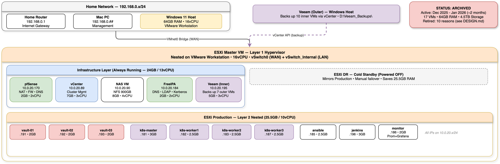
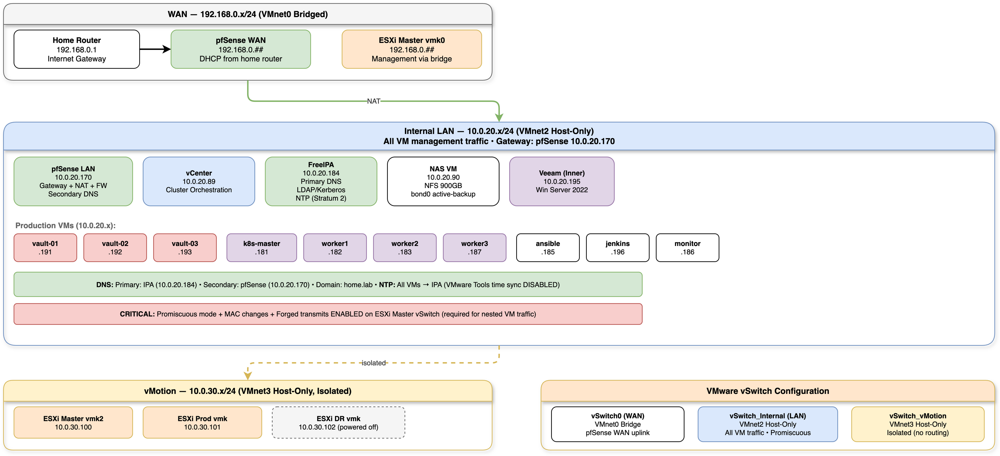
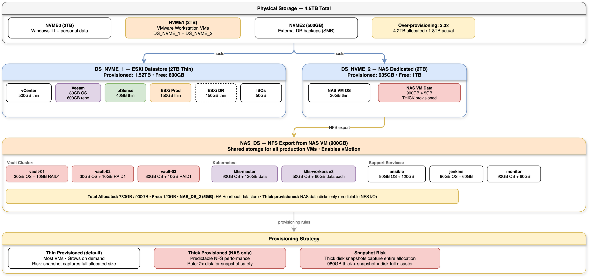
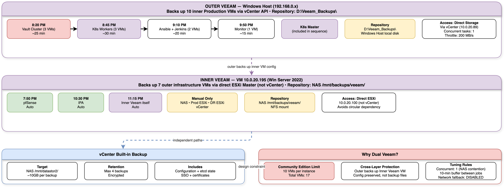
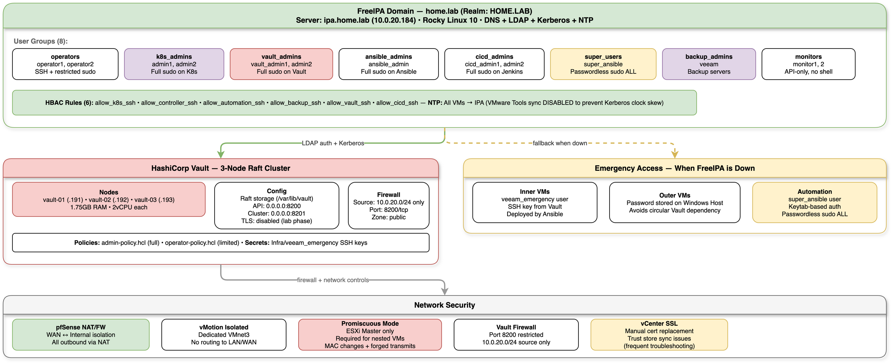
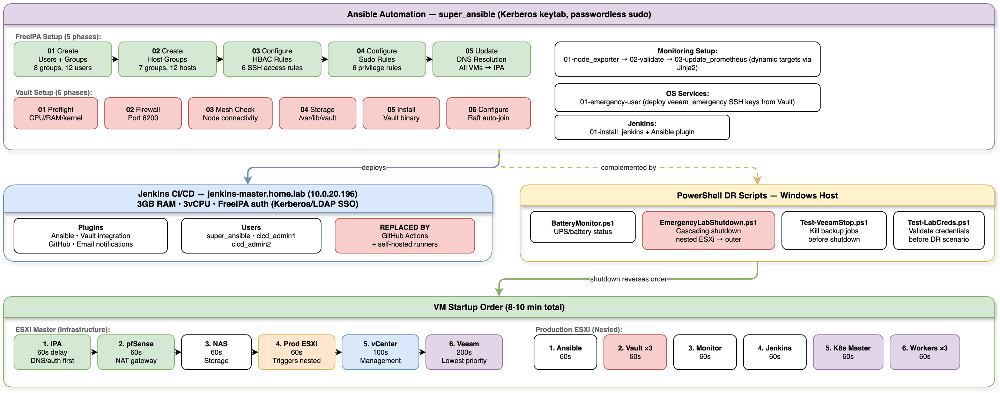
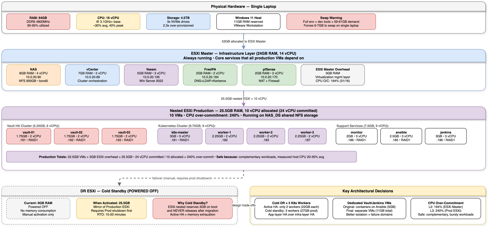
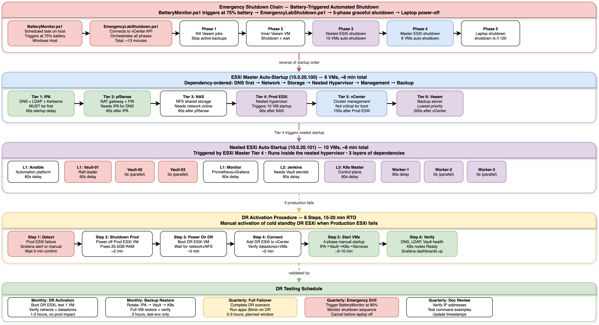
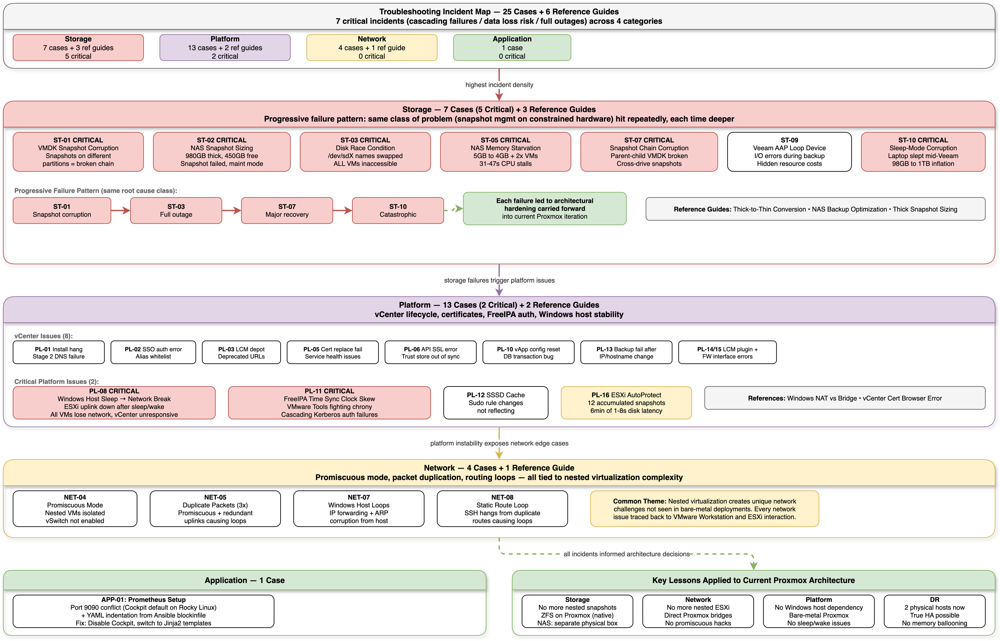

# PoC v1 Architecture Diagrams

9 diagrams covering the retired VMware-based PoC infrastructure. Source files are `.drawio` — open with [draw.io](https://app.diagrams.net) to edit.

> **Status:** Archived. These document the v1 infrastructure that was killed before the Kubernetes phase. See [`/diagrams/`](../../diagrams/) for current infrastructure diagrams.

---

## 00 — PoC Overview

High-level view — 17 VMs across nested ESXi, all IPs, service relationships.

---

## 01 — Network Architecture

WAN/LAN/vMotion, vSwitches, pfSense routing, DNS/NTP, nested VLAN topology.

---

## 02 — Storage Architecture

4.5TB NVMe layout, NFS exports, thin/thick provisioning, NAS datastore mapping.

---

## 03 — Backup Architecture

Dual Veeam instances (10-VM CE limit workaround), vCenter backup, schedule and retention.

---

## 04 — Security & Identity

FreeIPA 8 groups, Vault HA raft cluster, HBAC rules, emergency access procedures.

---

## 05 — Automation & CI/CD

Ansible playbook inventory, Jenkins pipeline, PowerShell DR scripts, automation coverage.

---

## 06 — Compute Resource Allocation

64GB RAM hierarchy (Windows → ESXi → Infra/Prod/DR), CPU over-commitment ratios, all 17 VM specs.

---

## 07 — DR Failover Lifecycle

Emergency shutdown chain (BatteryMonitor → 5-phase shutdown), auto-startup sequence, DR activation (15-20 min RTO).

---

## 08 — Troubleshooting Incident Map

25 cases across 4 categories, progressive failure chains (storage cascade pattern), lessons learned → current architecture.

