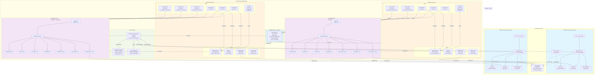

# Infrastructure Topology

Physical/virtual layout - Proxmox nodes, VMs, LXCs, AWS accounts, services, IPs.

```mermaid
graph TB
    subgraph AWS["AWS Hybrid Cloud"]
        subgraph AWS_DEV["AWS Dev Account (eu-west-1)"]
            AWS_DEV_VPC["VPC: 172.16.0.0/16"]
            AWS_DEV_WG["WireGuard EC2<br/>172.16.200.2:51820"]
            AWS_DEV_KMS["KMS Key<br/>Vault Auto-Unseal"]
            AWS_DEV_S3["S3 Bucket<br/>etcd-backup"]
            AWS_DEV_SM["Secrets Manager<br/>Credentials"]
            AWS_DEV_OIDC["OIDC Provider<br/>GitHub Auth"]
            AWS_DEV_VPC --> AWS_DEV_WG
            AWS_DEV_WG --> AWS_DEV_KMS
            AWS_DEV_WG --> AWS_DEV_S3
            AWS_DEV_WG --> AWS_DEV_SM
        end
        
        subgraph AWS_PROD["AWS Prod Account (eu-west-2)"]
            AWS_PROD_VPC["VPC: 172.17.0.0/16"]
            AWS_PROD_WG["WireGuard EC2<br/>172.17.200.2:51820"]
            AWS_PROD_KMS["KMS Key<br/>Vault Auto-Unseal"]
            AWS_PROD_S3["S3 Bucket<br/>etcd-backup"]
            AWS_PROD_SM["Secrets Manager<br/>Credentials"]
            AWS_PROD_VPC --> AWS_PROD_WG
            AWS_PROD_WG --> AWS_PROD_KMS
            AWS_PROD_WG --> AWS_PROD_S3
            AWS_PROD_WG --> AWS_PROD_SM
        end
        
        AWS_DEV_OIDC -.->|GitHub OIDC| GH["GitHub"]
        AWS_PROD_WG -.->|Branch: prod| GH
        AWS_DEV_WG -.->|Branch: dev| GH
    end

    subgraph GITHUB["GitHub - CI/CD"]
        GH["31 Workflows<br/>OIDC Auth<br/>Self-hosted Runners<br/>Flux Source Repo"]
    end

    subgraph ONPREM["On-Premises Infrastructure"]
        subgraph NET["Network Layer"]
            ROUTER["MikroTik L009UiGS-RM<br/>10.0.5.1<br/>13 VLANs<br/>Firewall + VPN Endpoint"]
            SWITCH["FS308GP L2 Switch<br/>VLAN 40: Storage<br/>VLAN 50-55: Prod<br/>VLAN 60-65: Dev"]
            AP["AC750 WiFi AP<br/>VLAN 5: Management<br/>unified_mgmt SSID"]
            ROUTER <-->|VPN WireGuard| AWS_DEV_WG
            ROUTER <-->|VPN WireGuard| AWS_PROD_WG
            ROUTER ---|ether6 Trunk| SWITCH
            ROUTER ---|mgmt| AP
        end

        subgraph STORAGE["Storage Plane - VLAN 40"]
            NAS["Synology NAS<br/>10.0.40.120<br/>NFS Server<br/>k8s-dev / k8s-prod shares<br/>Vzdump Backups<br/>ISOs + Templates"]
        end

        subgraph PVE_DEV["Proxmox Dev Host<br/>pve-dev.lab.local<br/>24GB Ryzen 7<br/>10.0.5.110"]
            subgraph DEV_VMS["VMs"]
                DEV_IPA["FreeIPA<br/>10.0.60.10<br/>Identity+DNS<br/>Kerberos"]
                DEV_M1["k8s-master1<br/>10.0.61.10"]
                DEV_M2["k8s-master2<br/>10.0.61.11"]
                DEV_M3["k8s-master3<br/>10.0.61.12"]
                DEV_W1["k8s-worker1<br/>10.0.64.10<br/>+VLAN40: 10.0.40.201"]
                DEV_W2["k8s-worker2<br/>10.0.64.11<br/>+VLAN40: 10.0.40.202"]
            end
            
            subgraph DEV_LXCS["LXCs"]
                DEV_VAULT["Vault Cluster x3<br/>10.0.62.10-12<br/>Raft + KMS unseal"]
                DEV_ANSIBLE["Ansible<br/>10.0.63.10<br/>Control Node"]
                DEV_RUNNER["GitHub Runner<br/>10.0.63.20<br/>Self-hosted"]
                DEV_NGINX["Nginx Proxy<br/>10.0.65.10<br/>Reverse Proxy"]
            end

            DEV_IPA --> |LDAP| DEV_VAULT
            DEV_M1 --> |Vault Auth| DEV_VAULT
            DEV_M2 --> |Vault Auth| DEV_VAULT
            DEV_M3 --> |Vault Auth| DEV_VAULT
        end

        subgraph PVE_PROD["Proxmox Prod Host<br/>pve-prod.lab.local<br/>64GB Ryzen 7<br/>10.0.5.100"]
            subgraph PROD_VMS["VMs"]
                PROD_IPA["FreeIPA<br/>10.0.50.10<br/>Identity+DNS<br/>Kerberos"]
                PROD_M1["k8s-master1<br/>10.0.51.10"]
                PROD_M2["k8s-master2<br/>10.0.51.11"]
                PROD_M3["k8s-master3<br/>10.0.51.12"]
                PROD_W1["k8s-worker1<br/>10.0.54.10<br/>+VLAN40: 10.0.40.101"]
                PROD_W2["k8s-worker2<br/>10.0.54.11<br/>+VLAN40: 10.0.40.102"]
                PROD_W3["k8s-worker3<br/>10.0.54.12<br/>+VLAN40: 10.0.40.103"]
            end
            
            subgraph PROD_LXCS["LXCs"]
                PROD_VAULT["Vault Cluster x3<br/>10.0.52.10-12<br/>Raft + KMS unseal"]
                PROD_ANSIBLE["Ansible<br/>10.0.53.10<br/>Control Node"]
                PROD_RUNNER["GitHub Runner<br/>10.0.53.20<br/>Self-hosted"]
                PROD_NGINX["Nginx Proxy<br/>10.0.55.10<br/>Reverse Proxy"]
            end

            PROD_IPA --> |LDAP| PROD_VAULT
            PROD_M1 --> |Vault Auth| PROD_VAULT
            PROD_M2 --> |Vault Auth| PROD_VAULT
            PROD_M3 --> |Vault Auth| PROD_VAULT
        end

        NAS ---|NFS Client| PVE_DEV
        NAS ---|NFS Client| PVE_PROD

        subgraph K8S_DEV["Kubernetes Dev<br/>3 Masters + 2 Workers"]
            FLUX_DEV["Flux CD<br/>GitOps Sync"]
            VAULT_INJ_DEV["Vault Agent Injector"]
            PROM_DEV["Prometheus 20Gi"]
            GRAF_DEV["Grafana 5Gi"]
            LOKI_DEV["Loki 50Gi / 7d"]
            MARIA_DEV["MariaDB 15Gi"]
            WP_DEV["WordPress HPA 2-3"]
            REMEDIATION_DEV["Remediation Pod"]
            ETCD_BACKUP_DEV["etcd-backup CronJob"]
            
            FLUX_DEV --> VAULT_INJ_DEV
            VAULT_INJ_DEV --> PROM_DEV
            VAULT_INJ_DEV --> GRAF_DEV
            VAULT_INJ_DEV --> LOKI_DEV
            VAULT_INJ_DEV --> MARIA_DEV
            VAULT_INJ_DEV --> WP_DEV
            VAULT_INJ_DEV --> REMEDIATION_DEV
            VAULT_INJ_DEV --> ETCD_BACKUP_DEV
        end

        subgraph K8S_PROD["Kubernetes Prod<br/>3 Masters + 3 Workers"]
            FLUX_PROD["Flux CD<br/>GitOps Sync"]
            VAULT_INJ_PROD["Vault Agent Injector"]
            PROM_PROD["Prometheus 50Gi"]
            GRAF_PROD["Grafana 10Gi"]
            LOKI_PROD["Loki 100Gi / 14d"]
            MARIA_PROD["MariaDB 50Gi"]
            WP_PROD["WordPress HPA 2-4"]
            REMEDIATION_PROD["Remediation Pod"]
            ETCD_BACKUP_PROD["etcd-backup CronJob"]
            
            FLUX_PROD --> VAULT_INJ_PROD
            VAULT_INJ_PROD --> PROM_PROD
            VAULT_INJ_PROD --> GRAF_PROD
            VAULT_INJ_PROD --> LOKI_PROD
            VAULT_INJ_PROD --> MARIA_PROD
            VAULT_INJ_PROD --> WP_PROD
            VAULT_INJ_PROD --> REMEDIATION_PROD
            VAULT_INJ_PROD --> ETCD_BACKUP_PROD
        end

        DEV_M1 ---|master| K8S_DEV
        DEV_M2 ---|master| K8S_DEV
        DEV_M3 ---|master| K8S_DEV
        DEV_W1 ---|worker| K8S_DEV
        DEV_W2 ---|worker| K8S_DEV

        PROD_M1 ---|master| K8S_PROD
        PROD_M2 ---|master| K8S_PROD
        PROD_M3 ---|master| K8S_PROD
        PROD_W1 ---|worker| K8S_PROD
        PROD_W2 ---|worker| K8S_PROD
        PROD_W3 ---|worker| K8S_PROD

        K8S_DEV ---|NFS CSI| NAS
        K8S_PROD ---|NFS CSI| NAS
        K8S_DEV ---|Vault Trust| DEV_VAULT
        K8S_PROD ---|Vault Trust| PROD_VAULT

        ETCD_BACKUP_DEV ---|STS Creds| AWS_DEV_S3
        ETCD_BACKUP_PROD ---|STS Creds| AWS_PROD_S3

        DEV_RUNNER ---|Flux Source| GH
        PROD_RUNNER ---|Flux Source| GH
    end

    K8S_DEV -.->|Branch: dev| GH
    K8S_PROD -.->|Branch: prod| GH

    style AWS_DEV fill:#e1f5fe
    style AWS_PROD fill:#e1f5fe
    style PVE_DEV fill:#fff3e0
    style PVE_PROD fill:#fff3e0
    style K8S_DEV fill:#f3e5f5
    style K8S_PROD fill:#f3e5f5
    style ONPREM fill:#fffde7
    style NET fill:#f1f8e9
    style STORAGE fill:#e0f2f1
```
