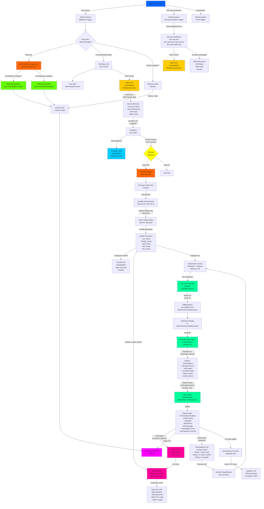

# GitOps & CI/CD Pipeline Flow

Full lifecycle from git commit through GitHub Actions, Terraform, Ansible, Flux reconciliation, and self-healing.

```mermaid
flowchart TD
    A["Git Commit Push"] -->|dev branch| B["GitHub Actions<br/>Webhook Trigger"]
    A -->|dev-security branch| C["GitHub Actions<br/>Security-sensitive Trigger"]
    A -->|prod branch| D["GitHub Actions<br/>Prod Trigger"]
    
    B --> E{"Path Filter:<br/>What Changed?"}
    E -->|AWS IaC| F["build-docker-images.yml<br/>detect-changes Job"]
    E -->|Proxmox/K8s/Ansible| G["Workflow Job<br/>Lock Check"]
    E -->|Docker images/**| H["Ubuntu-Latest<br/>Runner"]
    
    C -->|AWS IAM/KMS/Trust| I["Security Workflows<br/>dev-aws-iam<br/>dev-aws-kms-vault-unseal<br/>dev-aws-vault-trust"]
    
    G --> J["Mac-Mini<br/>Self-Hosted Runner"]
    
    F -->|remediation changed?| K["Build Remediation<br/>ghcr.io/remediation:latest"]
    F -->|etcd-backup changed?| L["Build etcd-backup<br/>ghcr.io/etcd-backup:latest"]
    
    H -->|Docker Login| M["GHCR Push<br/>--GitHub Token"]
    K --> M
    L --> M
    M --> N["Container Registry<br/>GHCR"]
    
    I -->|OIDC Token| O["AWS STS<br/>AssumeRole<br/>TerraformAdmin-dev"]
    I -->|terraform plan/apply| P["AWS Resources<br/>IAM Roles<br/>KMS Keys<br/>Secrets"]
    
    G -->|OIDC Token| Q["AWS STS<br/>AssumeRole<br/>Infrastructure-dev"]
    Q -->|Fetch from<br/>AWS Secrets Mgr| R["Secret Retrieval<br/>- Proxmox Token<br/>- Root Passwords<br/>- SSH Keys<br/>- KMS Creds"]
    
    R -->|terraform init<br/>-upgrade| S["Terraform<br/>Init & Plan"]
    S -->|State Backend| T["S3 State Lock<br/>DynamoDB<br/>distributed lock"]
    
    S -->|Human Review<br/>3-min window| U{"Manual<br/>Approval"}
    U -->|approved| V["Terraform Apply<br/>-auto-approve"]
    U -->|rejected| W["Job Fails"]
    
    V --> X["Proxmox VMs/LXCs<br/>Created"]
    X -->|Infra Ready| Y["Ansible Control Node<br/>10.0.63.10 / 10.0.53.10"]
    
    Y -->|GitHub Deploy Key<br/>SSH Auth| Z["Clone GitOps Repo<br/>Branch: dev/prod"]
    Z -->|ansible playbooks| AA["Ansible Execution<br/>- pre_setup<br/>- freeipa_setup<br/>- vault_setup<br/>- k8s_setup<br/>- flux_setup"]
    
    AA -->|Configure FreeIPA| AB["FreeIPA VM<br/>Identity/DNS<br/>super_bot user<br/>Keytabs"]
    AA -->|Deploy 3-node Cluster| AC["Vault Cluster<br/>KMS Auto-unseal<br/>AWS STS Creds"]
    AA -->|kubeadm init| AD["Kubernetes Cluster<br/>3 Masters + Workers<br/>HAProxy VIP"]
    
    AD -->|Flux Bootstrap| AE["Flux CD Controller<br/>watches:<br/>prod/dev branch"]
    
    AE -->|Watch Git<br/>every 1m| AF["GitRepository<br/>ssh://github.com/<br/>hybrid-cloud-infrastructure"]
    AF --> AG["Detected Change<br/>in:<br/>kubernetes/env/deployments/"]
    
    AG -->|reconcile| AH["Infrastructure Layer<br/>Kustomization<br/>interval: 5m"]
    AH -->|depends-on:<br/>Vault Agent Injector| AI["Deploy:<br/>- Namespaces<br/>- Storage Classes<br/>- Vault Agent<br/>- CoreDNS Patch<br/>- Ingress-nginx<br/>- metrics-server"]
    
    AI -->|Health Check<br/>vault-agent-injector<br/>Ready==true| AJ["Apps Layer<br/>Kustomization<br/>dependsOn: infrastructure"]
    
    AJ -->|deploy| AK["Deploy Apps:<br/>- Prometheus/Grafana<br/>- Loki/Promtail<br/>- MariaDB<br/>- WordPress<br/>- Alertmanager<br/>- Remediation Pod<br/>- etcd-backup CronJob"]
    
    AK -->|Vault Agent<br/>annotation injection| AL["Pod Sidecar<br/>injects secrets<br/>from Vault"]
    AL -->|K8s Auth| AC
    AC -->|temporary creds| AM["Apps Run with<br/>Vault-injected:<br/>- DB passwords<br/>- AWS STS creds<br/>- SMTP config"]
    
    AK -->|Image Pull| N
    
    AK -->|Node failure<br/>detection| AO["Remediation Pod<br/>2-phase check<br/>Phase 1: 5min scan<br/>Phase 1.5: 3min confirm<br/>Phase 2: escalate"]
    
    AO -->|Proxmox API| AP["Worker Reset/Reboot<br/>Auto-recovery"]
    AP --> AD
    
    AK -->|CronJob nightly| AQ["etcd-backup CronJob<br/>snapshot etcd"]
    AQ -->|Vault STS Creds| AR["Upload to S3<br/>Off-site backup<br/>encryption: KMS"]

    style A fill:#0066ff
    style F fill:#ff6600
    style K fill:#66ff00
    style L fill:#66ff00
    style N fill:#ff00ff
    style O fill:#ffcc00
    style Q fill:#ffcc00
    style T fill:#00ccff
    style U fill:#ffff00
    style V fill:#ff6600
    style AE fill:#00ff99
    style AH fill:#00ff99
    style AJ fill:#00ff99
    style AC fill:#ff0099
    style AL fill:#ff0099
```