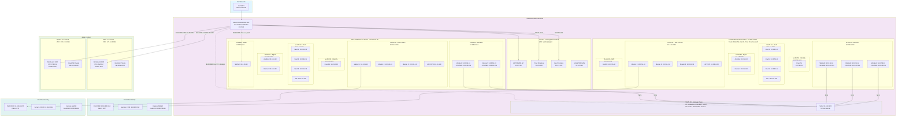

# Network Architecture

VLANs, subnets, MikroTik routing, WireGuard VPN tunnels, Calico CNI, storage plane isolation, firewall rules.

```mermaid
graph TB
    subgraph ISP["ISP Network"]
        ONT["ISP ONT<br/>Fiber Terminal"]
    end

    subgraph OnPrem["ON-PREMISES lab.local"]
        ONT --> MikroTik["MikroTik L009UiGS-RM<br/>Router/Firewall/VPN<br/>10.0.5.1"]

        subgraph Management["VLAN 5 - Management Plane<br/>WiFi: unified_mgmt"]
            AC750["AC750 WiFi AP<br/>10.0.5.10"]
            PveProd["Prod Proxmox<br/>10.0.5.100"]
            PveDev["Dev Proxmox<br/>10.0.5.110"]
            NAS_mgmt["ASUSTOR NAS<br/>10.0.5.120"]
        end

        subgraph Prod_Service["PROD SERVICE PLANES - VLANs 50-55<br/>Trunk: MikroTik ether5 - Prod Proxmox svc0"]
            subgraph Prod_Identity["VLAN 50 - Identity<br/>10.0.50.0/24"]
                FreeIPAProd["FreeIPA<br/>10.0.50.10"]
            end
            subgraph Prod_Control["VLAN 51 - K8s Control<br/>10.0.51.0/24"]
                K8sMaster1["Master 1: 10.0.51.10"]
                K8sMaster2["Master 2: 10.0.51.11"]
                K8sMaster3["Master 3: 10.0.51.12"]
                K8sAPIVIP["API VIP: 10.0.51.100"]
            end
            subgraph Prod_Vault["VLAN 52 - Vault<br/>10.0.52.0/24"]
                VaultNode1["Vault 1: 10.0.52.10"]
                VaultNode2["Vault 2: 10.0.52.11"]
                VaultNode3["Vault 3: 10.0.52.12"]
                VaultVIP["VIP: 10.0.52.100"]
            end
            subgraph Prod_Mgmt["VLAN 53 - Mgmt<br/>10.0.53.0/24"]
                AnsibleProd["Ansible: 10.0.53.10"]
                RunnerProd["Runner: 10.0.53.20"]
            end
            subgraph Prod_Workers["VLAN 54 - Workers<br/>10.0.54.0/24"]
                Worker1P["Worker1: 10.0.54.10<br/>+VLAN40: 10.0.40.101"]
                Worker2P["Worker2: 10.0.54.11<br/>+VLAN40: 10.0.40.102"]
                Worker3P["Worker3: 10.0.54.12<br/>+VLAN40: 10.0.40.103"]
            end
            subgraph Prod_DMZ["VLAN 55 - DMZ<br/>10.0.55.0/24"]
                NginxProd["NGINX: 10.0.55.10"]
            end
        end

        subgraph Dev_Service["DEV SERVICE PLANES - VLANs 60-65<br/>Trunk: MikroTik ether6 - Dev Proxmox svc0"]
            subgraph Dev_Identity["VLAN 60 - Identity<br/>10.0.60.0/24"]
                FreeIPADev["FreeIPA: 10.0.60.10"]
            end
            subgraph Dev_Control["VLAN 61 - K8s Control<br/>10.0.61.0/24"]
                K8sMaster1D["Master 1: 10.0.61.10"]
                K8sMaster2D["Master 2: 10.0.61.11"]
                K8sMaster3D["Master 3: 10.0.61.12"]
                K8sAPIVIPD["API VIP: 10.0.61.100"]
            end
            subgraph Dev_Vault["VLAN 62 - Vault<br/>10.0.62.0/24"]
                VaultNode1D["Vault 1: 10.0.62.10"]
                VaultNode2D["Vault 2: 10.0.62.11"]
                VaultNode3D["Vault 3: 10.0.62.12"]
                VaultVIPD["VIP: 10.0.62.100"]
            end
            subgraph Dev_Mgmt["VLAN 63 - Mgmt<br/>10.0.63.0/24"]
                AnsibleDev["Ansible: 10.0.63.10"]
                RunnerDev["Runner: 10.0.63.20"]
            end
            subgraph Dev_Workers["VLAN 64 - Workers<br/>10.0.64.0/24"]
                Worker1D["Worker1: 10.0.64.10<br/>+VLAN40: 10.0.40.201"]
                Worker2D["Worker2: 10.0.64.11<br/>+VLAN40: 10.0.40.202"]
            end
            subgraph Dev_DMZ["VLAN 65 - DMZ<br/>10.0.65.0/24"]
                NginxDev["NGINX: 10.0.65.10"]
            end
        end

        subgraph Storage["VLAN 40 - Storage Plane<br/>L2 Isolated on FS308GP Switch<br/>No router - direct NAS access"]
            NASStor["NAS: 10.0.40.120<br/>NFSv3 Server"]
        end

        Worker1P ---|NFS| NASStor
        Worker2P ---|NFS| NASStor
        Worker3P ---|NFS| NASStor
        Worker1D ---|NFS| NASStor
        Worker2D ---|NFS| NASStor
    end

    subgraph K8sProd["Prod K8s Overlay"]
        PodCIDRProd["Pod CIDR: 10.245.0.0/16<br/>Calico IPIP"]
        ServiceCIDRProd["Service CIDR: 10.96.0.0/12"]
        IngressProd["Ingress-NGINX<br/>NodePort 30080/30443"]
    end

    subgraph K8sDev["Dev K8s Overlay"]
        PodCIDRDev["Pod CIDR: 10.244.0.0/16<br/>Calico IPIP"]
        ServiceCIDRDev["Service CIDR: 10.96.0.0/12"]
        IngressDev["Ingress-NGINX<br/>NodePort 30080/30443"]
    end

    subgraph AWS["AWS CLOUD"]
        subgraph AWS_Dev["DEV - eu-west-1<br/>VPC: 172.16.0.0/16"]
            WGDev["WireGuard EC2<br/>172.16.200.2<br/>:51820 UDP"]
            RT53Dev["Route53 Private<br/>lab.local zone"]
        end
        subgraph AWS_Prod["PROD - eu-west-2<br/>VPC: 172.17.0.0/16"]
            WGProd["WireGuard EC2<br/>172.17.200.2<br/>:51830 UDP"]
            RT53Prod["Route53 Private<br/>lab.local zone"]
        end
    end

    MikroTik -->|"Dev VPN: 10.0.60-65.0/24"| WGDev
    MikroTik -->|"Prod VPN: 10.0.50-55.0/24"| WGProd
    MikroTik -->|ether5 trunk| PveProd
    MikroTik -->|ether6 trunk| PveDev
    MikroTik --> AC750

    K8sMaster1 --> PodCIDRProd
    K8sMaster1D --> PodCIDRDev

    MikroTik -.->|"BLOCKED: dev <-> prod"| NginxDev
    MikroTik -.->|"BLOCKED: svc <-> storage"| NASStor

    style ISP fill:#e1f5ff
    style OnPrem fill:#f3e5f5
    style AWS fill:#e8f5e9
    style Storage fill:#ede7f6
    style K8sProd fill:#e0f2f1
    style K8sDev fill:#e0f2f1
```
