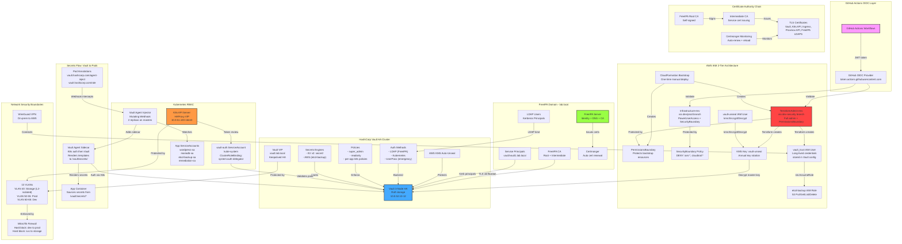

# Security & Identity Trust Architecture

Trust chains - GitHub OIDC, AWS 2-tier IAM, Vault HA, FreeIPA, K8s RBAC, secret injection, certificate chains.

```mermaid
graph TB
    subgraph "GitHub Actions OIDC Layer"
        GH["GitHub Actions Workflows"]
        OIDC_PROV["GitHub OIDC Provider<br/>token.actions.githubusercontent.com"]
    end

    subgraph "AWS IAM 2-Tier Architecture"
        CFNSTACK["CloudFormation Bootstrap<br/>One-time manual deploy"]
        PERM_BOUNDARY["PermissionsBoundary<br/>Protects bootstrap resources"]
        
        ADMIN_ROLE["TerraformAdmin-env<br/>via dev-security branch<br/>Full admin + PermissionsBoundary"]
        INFRA_ROLE["Infrastructure-env<br/>via dev/prod branch<br/>PowerUserAccess + SecurityBoundary"]
        SEC_BOUNDARY["SecurityBoundary Policy<br/>DENY: iam:*, cloudtrail:*"]
        
        VAULT_TRUST_USER["vault_trust IAM User<br/>Long-lived credentials<br/>stored in Vault config"]
        VAULT_ROLE["etcd-backup IAM Role<br/>S3 Put/Get/List/Delete"]
        
        KMS_KEY["KMS Key: vault-unseal<br/>Annual key rotation"]
        UNSEAL_USER["vault-unseal IAM User<br/>kms:Encrypt/Decrypt"]
    end

    subgraph "FreeIPA Domain - lab.local"
        FREEIPA["FreeIPA Server<br/>Identity + DNS + CA"]
        IPA_USERS["LDAP Users<br/>Kerberos Principals"]
        IPA_SERVICES["Service Principals<br/>vault/vault1.lab.local"]
        IPA_CA["FreeIPA CA<br/>Root + Intermediate"]
        CERTMONGER["Certmonger<br/>Auto cert renewal"]
    end

    subgraph "HashiCorp Vault HA Cluster"
        VAULT_HA["Vault 3-Node HA<br/>Raft storage<br/>10.0.52.10-12"]
        VAULT_SEAL["AWS KMS Auto-Unseal"]
        VAULT_VIP["Vault VIP<br/>vault.lab.local<br/>Keepalived HA"]
        VAULT_AUTH["Auth Methods<br/>- LDAP (FreeIPA)<br/>- Kubernetes<br/>- UserPass (emergency)"]
        VAULT_POLICIES["Policies<br/>- super_admin<br/>- readonly<br/>- per-app k8s policies"]
        VAULT_SECRETS["Secrets Engines<br/>- KV v2: secret/<br/>- AWS (etcd-backup)"]
    end

    subgraph "Kubernetes RBAC"
        K8S_API["K8s API Server<br/>HAProxy VIP<br/>10.0.51.100:16443"]
        VAULT_AUTH_SA["vault-auth ServiceAccount<br/>kube-system<br/>ClusterRoleBinding:<br/>system:auth-delegator"]
        APP_SA["App ServiceAccounts<br/>wordpress-sa<br/>mariadb-sa<br/>etcd-backup-sa<br/>remediation-sa"]
        VAULT_INJECTOR["Vault Agent Injector<br/>Mutating Webhook<br/>2 replicas on masters"]
    end

    subgraph "Secrets Flow: Vault to Pods"
        POD_ANNOTATIONS["Pod Annotations<br/>vault.hashicorp.com/agent-inject<br/>vault.hashicorp.com/role"]
        VAULT_AGENT["Vault Agent Sidecar<br/>K8s auth then Vault<br/>Renders templates<br/>to /vault/secrets/"]
        APP_CONTAINER["App Container<br/>Sources secrets from<br/>/vault/secrets/*"]
    end

    subgraph "Certificate Authority Chain"
        ROOT_CA["FreeIPA Root CA<br/>Self-signed"]
        INTERMEDIATE_CA["Intermediate CA<br/>Service cert issuing"]
        TLS_CERTS["TLS Certificates<br/>Vault, K8s API, Ingress,<br/>Proxmox API, FreeIPA LDAPS"]
        CERT_LIFECYCLE["Certmonger Monitoring<br/>Auto-renew + reload"]
    end

    subgraph "Network Security Boundaries"
        VLANS["13 VLANs<br/>VLAN 40: Storage (L2-isolated)<br/>VLAN 50-55: Prod<br/>VLAN 60-65: Dev"]
        MIKROTIK_FW["MikroTik Firewall<br/>Hard block: dev to prod<br/>Hard block: svc to storage"]
        WIREGUARD["WireGuard VPN<br/>On-prem to AWS"]
    end

    GH -->|JWT token| OIDC_PROV
    OIDC_PROV -->|Validate| ADMIN_ROLE
    OIDC_PROV -->|Validate| INFRA_ROLE

    CFNSTACK -->|Creates| PERM_BOUNDARY
    CFNSTACK -->|Creates| ADMIN_ROLE
    ADMIN_ROLE -->|Protected by| PERM_BOUNDARY
    INFRA_ROLE -->|Protected by| SEC_BOUNDARY
    ADMIN_ROLE -->|Terraform creates| VAULT_TRUST_USER
    ADMIN_ROLE -->|Terraform creates| KMS_KEY

    VAULT_TRUST_USER -->|sts:AssumeRole| VAULT_ROLE
    KMS_KEY -->|Decrypt master key| VAULT_HA
    UNSEAL_USER -->|kms:Encrypt/Decrypt| KMS_KEY

    FREEIPA -->|Issues certs| CERTMONGER
    IPA_CA -->|TLS verification| VAULT_HA
    IPA_SERVICES -->|Kerb principals| VAULT_HA
    IPA_USERS -->|LDAP bind| VAULT_AUTH

    VAULT_SEAL -->|Protects| VAULT_HA
    VAULT_AUTH -->|Backend| VAULT_HA
    VAULT_POLICIES -->|Enforce| VAULT_HA
    VAULT_SECRETS -->|Stores| VAULT_HA

    K8S_API -->|Token review| VAULT_AUTH_SA
    VAULT_AUTH_SA -->|Validates pods| VAULT_HA
    VAULT_INJECTOR -->|Watches| APP_SA

    POD_ANNOTATIONS -->|Webhook intercepts| VAULT_INJECTOR
    VAULT_INJECTOR -->|Adds sidecar| VAULT_AGENT
    VAULT_AGENT -->|Auth via K8s| VAULT_HA
    VAULT_AGENT -->|Renders secrets| APP_CONTAINER

    ROOT_CA -->|Signs| INTERMEDIATE_CA
    INTERMEDIATE_CA -->|Issues| TLS_CERTS
    CERT_LIFECYCLE -->|Monitors| TLS_CERTS

    VAULT_VIP -->|Protected by| VLANS
    K8S_API -->|Protected by| VLANS
    VLANS -->|Enforced by| MIKROTIK_FW
    WIREGUARD -->|Connects| VAULT_TRUST_USER

    style GH fill:#f9f,stroke:#333,stroke-width:2px
    style VAULT_HA fill:#4af,stroke:#333,stroke-width:2px
    style FREEIPA fill:#9f4,stroke:#333,stroke-width:2px
    style K8S_API fill:#f94,stroke:#333,stroke-width:2px
    style ADMIN_ROLE fill:#f44,stroke:#333,stroke-width:2px
```
