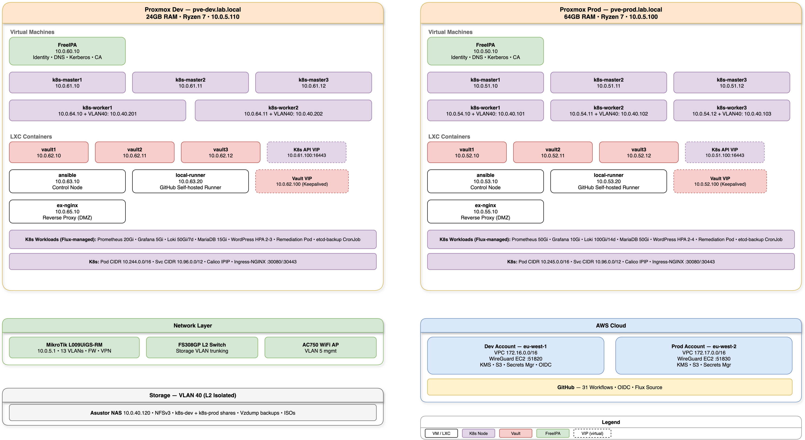
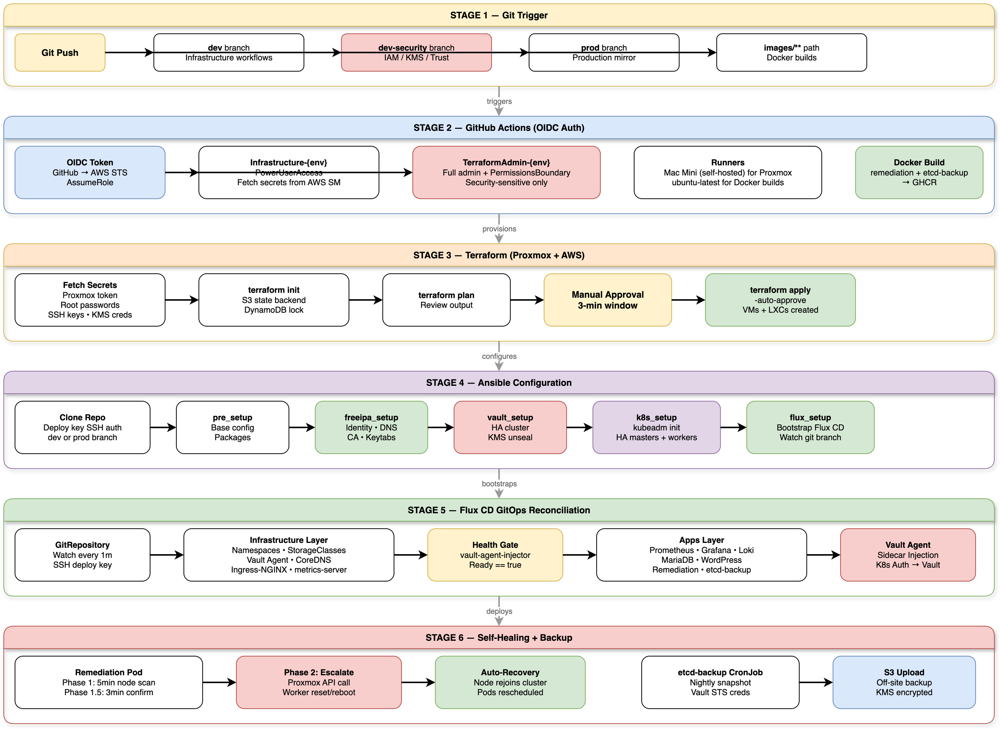
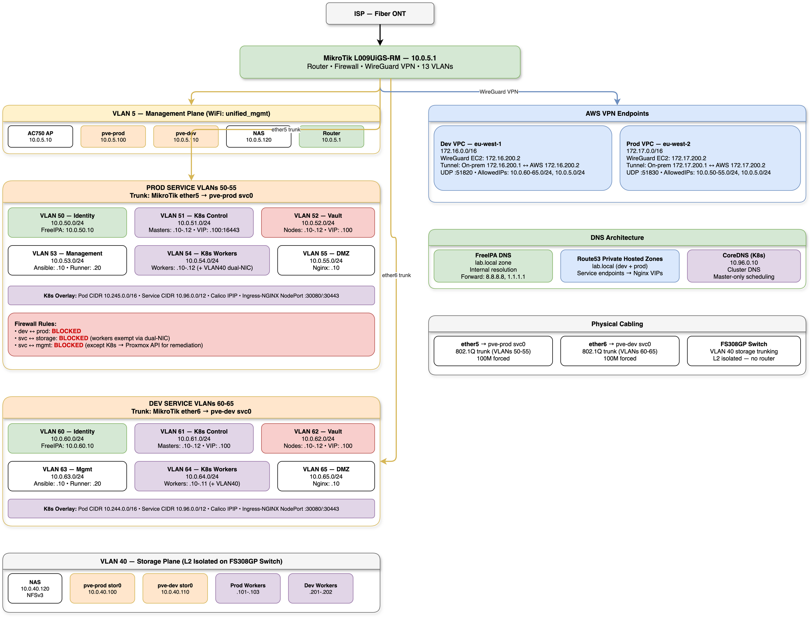
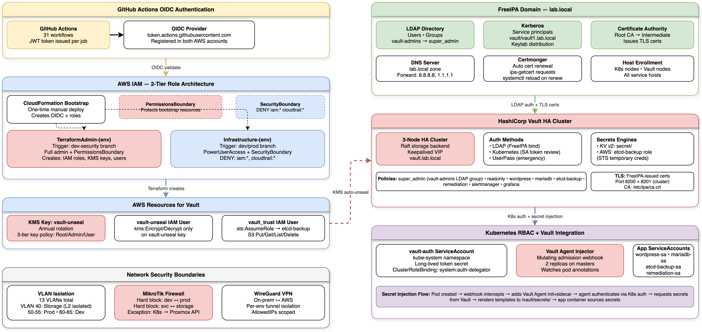
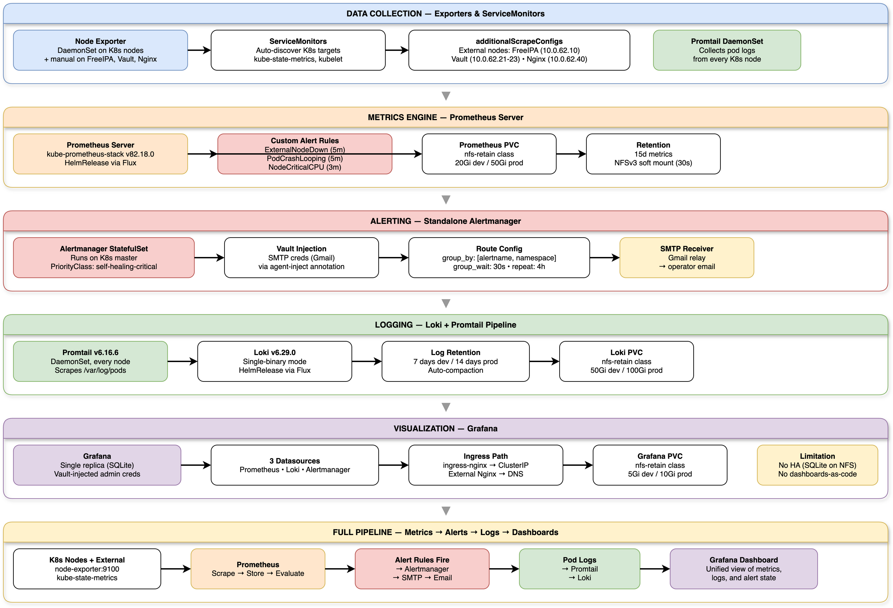
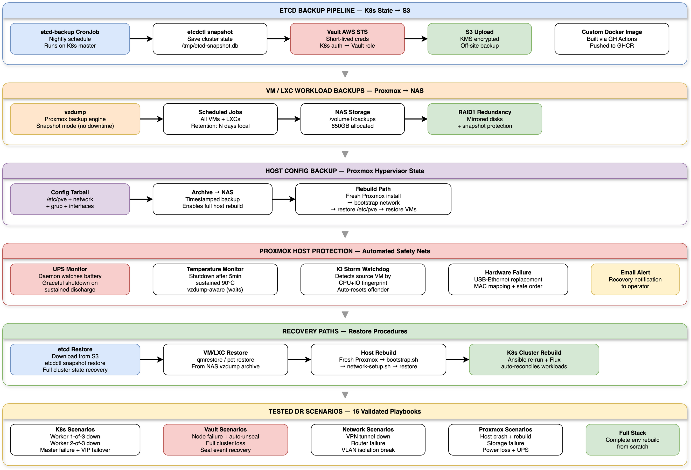
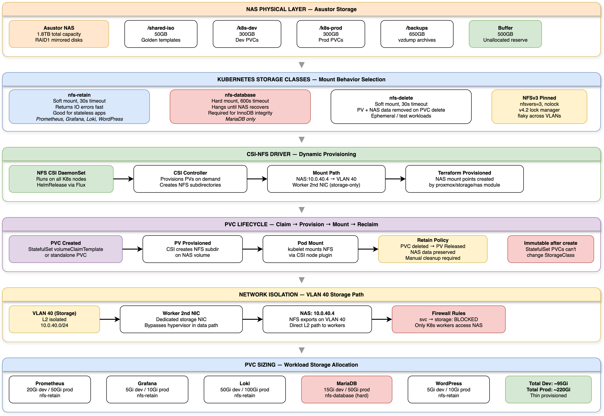

# Architecture Diagrams

8 diagrams covering the full hybrid cloud stack. Source files are `.drawio` — open with [draw.io](https://app.diagrams.net) to edit.

---

## 00 — Parent Overview

High-level view of the entire infrastructure — AWS, on-prem, GitHub, and how they connect.

---

## 01 — Infrastructure Topology

Physical and virtual layout — Proxmox servers, VMs, LXCs, NAS, VLANs, and the AWS VPN peer.

---

## 02 — GitOps & CI/CD Pipeline

GitHub Actions workflows, Flux CD reconciliation, OIDC auth flow, and the dev→prod promotion path.

---

## 03 — Network Architecture

13 VLANs, MikroTik routing, WireGuard VPN to AWS, firewall ACLs, and inter-VLAN traffic flow.

---

## 04 — Security & Identity Trust

FreeIPA (DNS, Kerberos, SSSD), Vault (KMS auto-unseal, raft HA, K8s injection), OIDC trust chain, and secret lifecycle.

---

## 05 — Monitoring & Observability Stack

Prometheus + Grafana + Loki + Alertmanager — metrics collection, log aggregation, alert routing, and Vault-injected SMTP.

---

## 06 — Disaster Recovery & Backup

16 tested DR scenarios, etcd backup pipeline (CronJob → Vault STS → S3), vzdump schedules, remediation pod self-healing, and recovery procedures.

---

## 07 — Storage & Data Architecture

Asustor NAS (NFS), 3 StorageClasses, PV lifecycle, VLAN 40 L2 isolation, backup targets, and data flow between K8s and storage.

